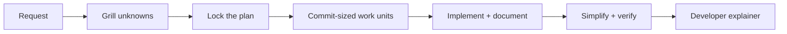

# WYSIWYShip

*What you spec is what you ship.*
**Plan it. Prove it. Just ship.**

WYSIWYShip gives Codex, GitHub Copilot, Claude Code, and Pi one repeatable way to plan, implement, document, simplify, verify, and explain code changes.

## The problem

Coding agents are good at producing code, but a usable development workflow also has to answer:

- Did the agent understand the goal, boundaries, and acceptance criteria before editing?
- Can it finish routine implementation without asking for constant direction?
- Did documentation, tests, and public contracts stay synchronized with the code?
- Is the result simpler, verified, reviewable, and understandable by another developer?

WYSIWYShip turns those questions into one host-neutral workflow with deterministic local checks. It is self-contained: installation copies reviewed files from this repository and does not fetch another skill pack or runtime dependency.

## Install in a project

Prerequisites: Bash, Python 3, and at least one supported coding host.

```bash
git clone https://github.com/lmathia2/coding_tools.git ~/src/coding_tools
cd ~/src/coding_tools
bash wysiwyship/install.sh all /absolute/path/to/project
```

Use `codex`, `copilot`, `claude`, or `pi` instead of `all` to install one adapter. Reload the coding host after installation.

## Use it

| Host | Develop | Review a PR | Understand the code |
|---|---|---|---|
| Codex | normal coding request or `$engineering-workflow` | `$pr-review` | `$eli5` |
| GitHub Copilot | `Dev` agent | `ReviewPR` agent | `eli5` skill |
| Claude Code | `/dev <task>` | `/review-pr <task>` | `/eli5 <project>` |
| Pi | `/dev <task>` | `/review-pr <task>` | `/eli5 <project>` |

A development run follows this contract:



Interactive planning asks only the decisions needed to lock the plan. Prefix the task with `auto` to let the coordinator answer those questions from repository evidence and reversible assumptions. After the lock, normal execution continues with little human input.

## What gets installed

- Host-native commands, agents, and skills for the selected adapters.
- `.wysiwyship/` with model routing, documentation and complexity checks, work-unit tooling, and an install manifest.
- A transparent model-discovery report at `.wysiwyship/model-discovery.json` when discovery is enabled.

Project source and operational state remain separate: workflow policy lives with the project, while resumable work-unit state and generated explainers live under ignored `.agent-state/`.

See the [developer guide](wysiwyship/README.md) for installation choices, the architecture, expected behavior, and troubleshooting.

## Evaluate the workflow

The [local evaluation suite](wysiwyship/evals/README.md) starts with two substantial
engineering pilots: durable job processing and tenant isolation. It includes
working applications, reference solutions, acceptance tests, and a Python-standard-library
runner for baseline/workflow comparisons. Eight additional tasks are planned after
pilot calibration; model runs are explicit, not part of fixture validation.

See [TODOS.md](TODOS.md) for calibration, the remaining tasks, and validation gaps.
