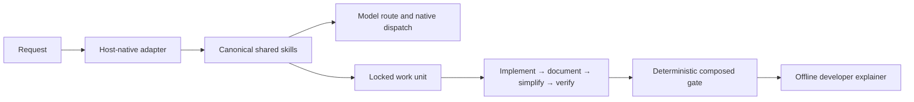

# Architecture

WYSIWYShip separates a canonical, host-neutral quality policy from thin native
execution adapters. The policy says what evidence a development run must
produce; Codex, Copilot, Claude Code, or Pi decides how its own model sessions,
agents, permissions, isolation, and continuation execute that policy.

## Source ownership

- `wysiwyship/shared/skills/` owns canonical workflow behavior.
- `wysiwyship/{codex,copilot,claude-code,pi}/` owns thin host entry points.
- `wysiwyship/config/` owns provider-neutral model profiles and translation.
- `wysiwyship/tools/` owns deterministic work units, routing receipts,
  documentation checks, complexity, wiki grounding, and the composed gate.
- `wysiwyship/scripts/install_harness.py` owns transactional installation.
- `wysiwyship/packages/` is generated from canonical sources and is never edited
  directly.

## Installed versus operational state

An installed project keeps reviewable tools and config in `.wysiwyship/` and its
host adapters in the host's own directories. Temporary coordination data stays
under ignored `.agent-state/`. The installer copies every standard-library tool,
then creates the default wiki skeleton only for paths that do not already exist.

## Completion gate

`tools/check.py:run_checks` composes the contract. It checks every code commit for
authoritative documentation evidence, scores changed Python functions, enforces
the wiki refresh cadence and integrity, runs configured argument-array commands,
optionally checks repository cleanliness, and validates work-unit state.

The wiki tool itself never invokes a model. It initializes pages, verifies the
manifest, counts commits, and records full refresh generations. The active host
produces the prose only when the configured cadence is due.
