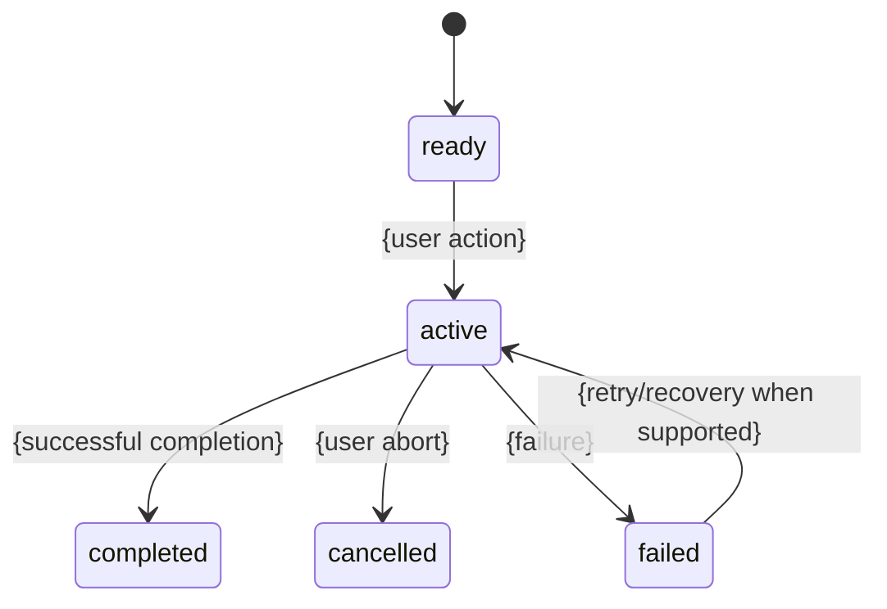

# {Feature}

## Summary and entry points

Explain the user outcome, where the feature appears, how it is entered/invoked, who can use it, and the signal that it is active.

## Normal flow

Describe the ordinary successful path in user terms. State the final observable state and durable side effects.

## Lifecycle and state transitions

Replace the example with only user-visible states and transitions. Explain:

- what is captured/validated at start;
- the short/early-exit path;
- what makes work committed or no longer freely cancellable;
- what changes while active;
- what is persisted/emitted at completion;
- what remains or rolls back after failure.

## Variants, permissions, and configuration

| Condition | At start | During/after |
|---|---|---|
| {role/mode/flag/state/device} | {behavior} | {behavior} |

Use the stable variant axis from the README. State `No observable effect` where appropriate.

## Cancellation, interruption, failure, and recovery

| Event | Before durable work | After work begins | Recovery/next state |
|---|---|---|---|
| Explicit user abort | | | |
| User leaves or starts another action | | | |
| Dependency/network/environment failure | | | |
| Target changes concurrently | | | |
| Session/input/process disappears | | | |
| Timeout, retry, or duplicate delivery | | | |
| {Product-specific event} | | | |

Fill every relevant row. Distinguish clean completion, cancellation, partial success, retry, and permanent failure.

## Interactions with cross-cutting systems

Use the project-wide order. Cover the applicable concerns: identity/authorization, history/audit, persistence/sync, validation, external side effects, configuration, accessibility/input, observability/recovery, compatibility/migration.

## Limits and edge cases

Document empty state, first/last item, boundaries and maxima, repeated actions, stale state, ordering, unsupported combinations, partial data, and device/environment-specific behavior that users can notice.

## Evidence and verification

- source commit/build: `{commit}`
- primary implementation: `{paths/symbols}`
- behavioral tests: `{paths/test names}`
- existing docs: `{paths}`
- verification checklist: `{relative link and IDs}`
- status: `drafted` | `verified` | `needs revision`

## Open questions

List only behavior that remains unresolved, contradictory, blocked, or likely incorrect. Link suspected defects to `bug-triage.md`.
