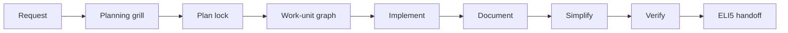
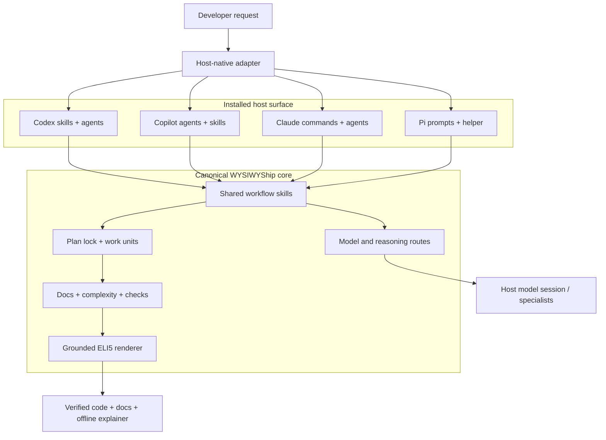

# WYSIWYShip

*What you spec is what you ship.*
**Plan it. Prove it. Just ship.**

WYSIWYShip is a self-contained software-development workflow for Codex, GitHub Copilot, Claude Code, and Pi. It gives each host the same planning, implementation, documentation, simplification, verification, review, and developer-explanation contract.

## Why it exists

A coding model can generate a plausible patch without producing a dependable engineering result. The common failure modes are broader:

- coding starts while goals, constraints, or acceptance criteria are still ambiguous;
- the agent repeatedly asks for direction during routine implementation;
- code changes without the documentation or contracts needed to understand it;
- complexity grows because nobody measures or simplifies it;
- verification becomes a summary of intent instead of executable evidence;
- the next developer sees what changed, but not how the system works or why it was designed that way.

WYSIWYShip moves collaboration to the beginning, locks the important decisions,
then lets execution run quickly. Its priority is explicit: quality first, then
efficiency. Completion requires code, live documentation, simplicity evidence,
executable verification, and a grounded explanation of the result; within those
constraints, the workflow minimizes code, process, loaded context, model spend,
and output tokens.

The guarantee is procedural: a run cannot call itself complete while required
evidence is missing. It is not a promise that an agent or test suite can make
software defect-free.

## Quick start

### Prerequisites

- Bash and Python 3;
- an existing project directory;
- at least one supported host: Codex, GitHub Copilot, Claude Code, or Pi.

The harness itself installs no Python, npm, MCP, or external skill dependency.

### 1. Clone the repository

```bash
git clone https://github.com/lmathia2/coding_tools.git ~/src/coding_tools
cd ~/src/coding_tools
```

### 2. Install into a project

Project-local installation is recommended because the workflow configuration can be reviewed and versioned with the codebase.

```bash
bash wysiwyship/install.sh all /absolute/path/to/project
```

Install only one adapter when appropriate:

```bash
bash wysiwyship/install.sh codex /absolute/path/to/project
bash wysiwyship/install.sh copilot /absolute/path/to/project
bash wysiwyship/install.sh claude /absolute/path/to/project
bash wysiwyship/install.sh pi /absolute/path/to/project
```

The installer preflights every destination, backs up managed paths it replaces, prints what it detected and configured, and writes `.wysiwyship/install-manifest.json`. Model discovery is read-only and stores its evidence in `.wysiwyship/model-discovery.json`. It also initializes a default grounded developer wiki under `docs/wiki/` without overwriting existing files.

Preview without writing:

```bash
bash wysiwyship/install.sh all /absolute/path/to/project --dry-run
```

### 3. Reload the host and start

Open the installed project root in a fresh host session, then use the native entry point:

| Host | Develop | Review a PR | Explain the project |
|---|---|---|---|
| Codex | normal coding request or `$engineering-workflow` | `$pr-review` | `$eli5` |
| GitHub Copilot | select `Dev` | select `ReviewPR` | invoke `eli5` |
| Claude Code | `/dev <task>` | `/review-pr <task>` | `/eli5 <project>` |
| Pi | `/dev <task>` | `/review-pr <task>` | `/eli5 <project>` |

For example:

```text
/dev add idempotency keys to payment creation without changing the response shape
```

The planning phase may ask focused questions about acceptance, scope, compatibility, or operational behavior. Once you approve the decision record, execution continues with minimal interruption.

Use `auto` when you want the same planning analysis without an interactive interview:

```text
/dev auto add idempotency keys to payment creation
```

Auto mode records its questions, answers, and assumptions. It cannot grant itself permission for destructive actions or expand the requested scope.

### 4. Verify or upgrade the installation

```bash
bash wysiwyship/install.sh all /absolute/path/to/project --status
git pull
bash wysiwyship/install.sh all /absolute/path/to/project
```

If a command or skill does not appear, confirm that the host was reloaded at the installed project root and inspect the status output.

## What to expect from a development run



1. **Plan:** inspect repository evidence and resolve goals, acceptance criteria, scope, alternatives, assumptions, and constraints.
2. **Lock:** record the decisions that implementation may rely on.
3. **Implement:** split non-trivial work into coherent commit-sized units and run independent units in parallel only when ownership is disjoint.
4. **Document:** update purpose, intent, contracts, invariants, and operational behavior in the same logical commit as code.
5. **Simplify:** measure changed-function cyclomatic complexity and improve the design without gaming the score.
6. **Verify:** run the repository's configured tests, builds, static checks, documentation checks, and committed-range gate.
7. **Explain:** generate an offline developer walkthrough showing how to use the result, its core concepts, source architecture, representative execution flow, design decisions, and proof.

Execution reopens planning only when evidence invalidates a material decision, a public contract or scope must expand, consequences change materially, or new authority is required.

## Core concepts

To test these claims on real changes, see the [local evaluation suite](evals/README.md).
The initial milestone provides two multi-file engineering pilots and a
dependency-free runner; the ten-task catalog clearly separates runnable pilots
from planned tasks. Deterministic fixture verification does not run a model.

### Planning grill and plan lock

The grill is the deliberate human-collaboration boundary. It asks only high-value unresolved questions and pairs each with a recommendation and tradeoff. The lock is a compact decision record: goals, acceptance, in/out scope, assumptions, alternatives, and any remaining uncertainty.

### Commit-sized work units

Each work unit owns a coherent goal and path set and follows:

```text
plan -> implement -> document -> simplify -> verify
```

The optional `.agent-state/work-units/` ledger makes long, parallel, or interrupted work resumable. It is execution state, not a replacement for the accepted plan or repository documentation.

### Live documentation

Documentation evolves with the code. A code commit updates the nearest authoritative README, architecture document, contract, example, or runbook—or records `Docs-Impact: none — <concrete reason>` when behavior and understanding genuinely did not change.

The separate `docs/wiki/` teaching layer is on by default. Every five commits,
the active host rebuilds all declared pages from current repository evidence and
advances a refresh marker; configure `wiki.refresh_every_commits` as `1` for
every-commit refresh. Its structure and cadence are part of the composed gate,
but generated wiki prose never substitutes for the authoritative per-commit docs.

### Four lightweight coding rules

Before implementation, the workflow traces the affected path and applies four
rules: prefer repository reuse → standard library → platform native → installed
dependencies → a clear one-line/direct solution → local code last; avoid new
dependencies for behavior a few clear lines can provide; never weaken safety,
trust boundaries, or data-loss handling for brevity; and annotate deliberate
design ceilings with a measurable upgrade trigger. These rules guide choices—
they do not require deleting working code or optimizing line count.

The dependency-free Python analyzer scores changed functions and reports baseline deltas:

```bash
python3 .wysiwyship/tools/complexity.py path/to/code.py --compare-ref <base-ref>
```

The score is a design signal, not a target to game. Extraction is useful when it improves cohesion, names a responsibility, or removes nested decisions.

### Deterministic completion gate

Projects add their native commands to `.wysiwyship/config/checks.json`. The range gate combines those commands with documentation evidence, grounded-wiki cadence and integrity, complexity, work-unit state, and repository cleanliness:

```bash
python3 .wysiwyship/tools/check.py <base-ref> --head HEAD
```

An unexecuted check is never reported as passing.

### Grounded ELI5 handoff

ELI5 means the simplest accurate developer explanation, not a high-level product pitch. It reads code, tests, contracts, configuration, and verification evidence, then teaches:

- what problem the repository or change solves;
- the exact first-use path and what the developer should expect;
- the core concepts and vocabulary;
- which modules own which responsibilities;
- how one real request flows through named files, symbols, and contracts;
- why important boundaries and tradeoffs exist;
- what is proven, limited, or still uncertain.

The output is one offline HTML file under `.agent-state/eli5/` unless you request a versioned documentation path.

### Model routing

`config/models.json` defines provider-neutral `fast`, `normal`, `deep`, and `top` lanes. Installation selects models only when host evidence supports them; otherwise it leaves selection to the host/session default. Disable discovery with `--no-model-discovery` for a static-profile install. A fresh Pi child uses its own default, not the parent's interactive model.

At execution time, the workflow resolves a route, invokes the named specialist, and checks an invocation receipt. A small inline change explicitly keeps the current session model. Reports distinguish **requested settings**, **invocation evidence**, and **effective settings** (`UNVERIFIED` when unavailable). Configuration alone is never a claimed model switch. See the [dispatch contract and commands](docs/WORKFLOW_CONTRACTS.md#dispatch-and-evidence-api) for ledger gates, review lanes, and the optional requirement for host-confirmed settings.

## Architecture



### Source ownership

| Path | Responsibility |
|---|---|
| `shared/skills/` | Canonical host-neutral workflow policy and ELI5 renderer |
| `codex/`, `copilot/`, `claude-code/`, `pi/` | Thin host-native entry points and specialist definitions |
| `config/` | Model profiles, host discovery, and adapter translation |
| `tools/` | Work units, documentation gate, complexity, wiki cadence, routing, and verification |
| `scripts/install_harness.py` | Transactional project/global installation |
| `scripts/build_packages.py` | Reproducible Copilot and Claude plugin bundles |
| `packages/` | Generated native bundles; never edit these copies directly |
| `docs/` | Live architecture and workflow contracts; `REFERENCE.md` is generated |

### Installed project state

| Path | Lifetime |
|---|---|
| Host directories such as `.agents/`, `.codex/`, `.github/`, `.claude/`, `.pi/` | Reviewable host adapters |
| `.wysiwyship/` | Reviewable tools, configuration, templates, provenance, and manifest |
| `.agent-state/` | Ignored operational ledgers, experiment records, and generated explainers |

Canonical shared skills are copied into host-specific layouts. Copilot and Claude native packages are generated from the same source and checked for drift. The project and global installers perform the same mapping transactionally.

## PR review

`ReviewPR` / `/review-pr` checks an exact PR HEAD in an isolated worktree. It combines semantic review with executable project checks, verifies documentation and complexity evidence, escalates only high-risk boundaries, and attempts to falsify serious findings before reporting them.

## Other installation options

Global installation makes the workflows available across projects for the current user:

```bash
bash wysiwyship/install-global.sh all
bash wysiwyship/install-global.sh all --status
```

Native Copilot and Claude plugins are also available:

```bash
copilot plugin install lmathia2/coding_tools:wysiwyship/packages/copilot
claude plugin marketplace add lmathia2/coding_tools
claude plugin install wysiwyship@coding-tools
```

Prefer the project installer when Codex or Pi is required, when model discovery should configure the target project, or when the workflow policy should travel with the repository. Avoid conflicting project and global copies unless the override is intentional.

## Further reference

- [Architecture](docs/ARCHITECTURE.md)
- [Workflow contracts](docs/WORKFLOW_CONTRACTS.md)
- [Documentation policy](docs/DOCUMENTATION_POLICY.md)
- [Self-contained distribution](docs/SELF_CONTAINED.md)
- [Generated adapter reference](docs/REFERENCE.md)
- [Changelog](CHANGELOG.md)
